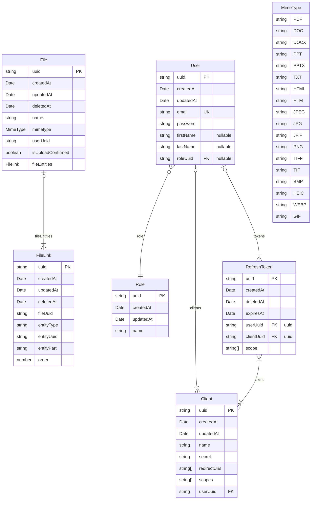

```mermaid
erDiagram
    File o|--|{ FileLink : fileEntities
    File {
        string uuid PK
        Date createdAt
        Date updatedAt
        Date deletedAt
        string name
        MimeType mimetype
        string userUuid
        boolean isUploadConfirmed
        Filelink fileEntities
    }
    FileLink {
        string uuid PK
        Date createdAt
        Date updatedAt
        Date deletedAt
        string fileUuid
        string entityType
        string entityUuid
        string entityPart
        number order
    }

    User }o--|| Role : role
    User o|--|{ Client : clients
    User o|--|{ RefreshToken : tokens

    User {
        string uuid PK
        Date createdAt
        Date updatedAt
        string email UK
        string password
        string firstName "nullable"
        string lastName "nullable"
        string roleUuid FK "nullable"
    }

    Role{
        string uuid PK
        Date createdAt
        Date updatedAt
        string name
    }

    Client{
        string uuid PK
        Date createdAt
        Date updatedAt
        string name
        string secret
        string[] redirectUris
        string[] scopes
        string userUuid FK
    }

    RefreshToken }|--|{ Client : client

    RefreshToken{
        string uuid PK
        Date createdAt
        Date deletedAt
        Date expiresAt
        string userUuid FK "uuid"
        string clientUuid FK "uuid"
        string[] scope
    }


    MimeType {
      string PDF
      string DOC
      string DOCX
      string PPT
      string PPTX
      string TXT
      string HTML
      string HTM
      string JPEG
      string JPG
      string JFIF
      string PNG
      string TIFF
      string TIF
      string BMP
      string HEIC
      string WEBP
      string GIF
    }
```
